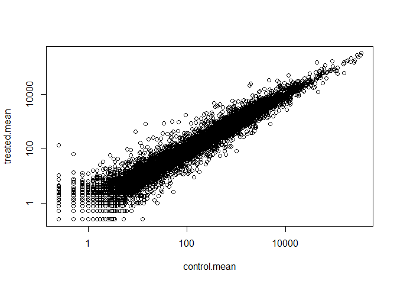
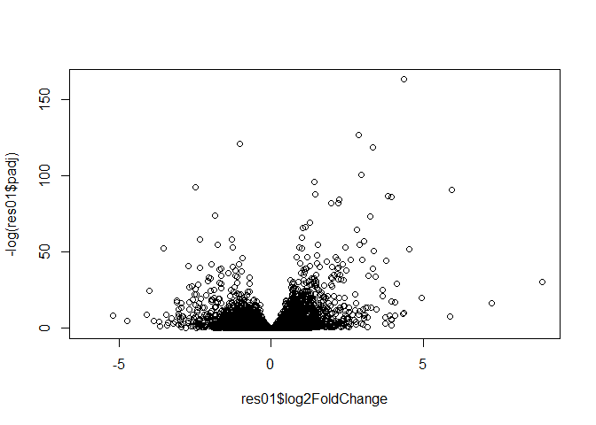
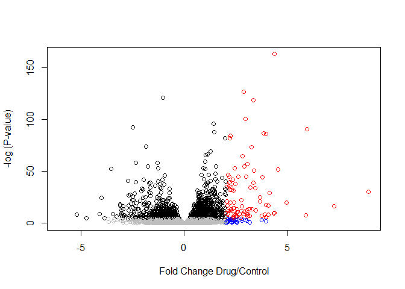

Class-14: Transcriptomics
================

Let's first store our data in vectors

``` r
counts <- read.csv("airway_scaledcounts.csv", stringsAsFactors = FALSE, row.names = 1)

metadata <-  read.csv("airway_metadata.csv", stringsAsFactors = FALSE)

head(counts)
```

    ##                 SRR1039508 SRR1039509 SRR1039512 SRR1039513 SRR1039516
    ## ENSG00000000003        723        486        904        445       1170
    ## ENSG00000000005          0          0          0          0          0
    ## ENSG00000000419        467        523        616        371        582
    ## ENSG00000000457        347        258        364        237        318
    ## ENSG00000000460         96         81         73         66        118
    ## ENSG00000000938          0          0          1          0          2
    ##                 SRR1039517 SRR1039520 SRR1039521
    ## ENSG00000000003       1097        806        604
    ## ENSG00000000005          0          0          0
    ## ENSG00000000419        781        417        509
    ## ENSG00000000457        447        330        324
    ## ENSG00000000460         94        102         74
    ## ENSG00000000938          0          0          0

``` r
head(metadata)
```

    ##           id     dex celltype     geo_id
    ## 1 SRR1039508 control   N61311 GSM1275862
    ## 2 SRR1039509 treated   N61311 GSM1275863
    ## 3 SRR1039512 control  N052611 GSM1275866
    ## 4 SRR1039513 treated  N052611 GSM1275867
    ## 5 SRR1039516 control  N080611 GSM1275870
    ## 6 SRR1039517 treated  N080611 GSM1275871

> How many?

``` r
nrow(counts)
```

    ## [1] 38694

Quality control

``` r
colnames(counts)
```

    ## [1] "SRR1039508" "SRR1039509" "SRR1039512" "SRR1039513" "SRR1039516"
    ## [6] "SRR1039517" "SRR1039520" "SRR1039521"

wE NOICE THERE'S A SLIGHT DISCREPANCY

``` r
metadata$id
```

    ## [1] "SRR1039508" "SRR1039509" "SRR1039512" "SRR1039513" "SRR1039516"
    ## [6] "SRR1039517" "SRR1039520" "SRR1039521"

To have R do this for me in the future

``` r
all( colnames(counts) == metadata$id )
```

    ## [1] TRUE

We did this because this will be required when we use DEseq later!

Section 3: Toy differential gene expression
-------------------------------------------

This section is a walk through of gene expression analysis
==========================================================

Lets perform some exploratory differential gene expression analysis. Note: this analysis is for demonstration only. NEVER do differential expression analysis this way!

Our metadata file tells us which columns of the countData are drug treated and control (i.e. non-drug) Look at the metadata object again to see which samples are control and which are drug treated.

``` r
control.inds <- metadata$dex == "control"

control <- metadata[control.inds,]

control
```

    ##           id     dex celltype     geo_id
    ## 1 SRR1039508 control   N61311 GSM1275862
    ## 3 SRR1039512 control  N052611 GSM1275866
    ## 5 SRR1039516 control  N080611 GSM1275870
    ## 7 SRR1039520 control  N061011 GSM1275874

``` r
head(counts[, control$id])
```

    ##                 SRR1039508 SRR1039512 SRR1039516 SRR1039520
    ## ENSG00000000003        723        904       1170        806
    ## ENSG00000000005          0          0          0          0
    ## ENSG00000000419        467        616        582        417
    ## ENSG00000000457        347        364        318        330
    ## ENSG00000000460         96         73        118        102
    ## ENSG00000000938          0          1          2          0

``` r
control.mean <- rowSums(counts[,control$id]) / 4
```

> Q1. How would you make the above code more robust? What would happen if you were to add more samples. Would the values obtained with the excat code above be correct?

When calculating the mean, I would divide by ncol(metadata) so that it would be applicable even in a study with more samples. Sometimes we might ahve more than 4 samples in our data, and this code as currently written would have to be modified. HOwever, if we used ncol - it would be a simple copy/paste job.

A better code would be as follows

``` r
control.mean <- rowSums(counts[,control$id]) / length(control$id)
```

> Q2. Follow the same procedure for the treated samples (i.e. calculate the mean per gene accross drug treated samples and assign to a labeled vector called treated.mean)

``` r
treated.inds <- metadata$dex == "treated"

treated <- metadata[treated.inds,]

treated.mean <- rowSums(counts[,treated$id]) / length(treated$id)

head(treated.mean)
```

    ## ENSG00000000003 ENSG00000000005 ENSG00000000419 ENSG00000000457 
    ##          658.00            0.00          546.00          316.50 
    ## ENSG00000000460 ENSG00000000938 
    ##           78.75            0.00

Let's store the control.mean and treated.mean together for ease of use:

``` r
meancounts <- data.frame(control.mean, treated.mean)
```

LEt's do a little data analysis to compare our treated and cotnrol means!

What is the sum counts across al genes in control and treated?

``` r
colSums(meancounts)
```

    ## control.mean treated.mean 
    ##     23005324     22196524

If the drug did absolutely nothing, these means should be the same. If we plotted the treated vs. the control. It should be a straight line w/ m=1.

``` r
plot(meancounts)
```


Note, there's tremendous overlap within the small exprewssion zone of both genes. Dr. Grant suggests we make this a log scale.

``` r
plot(meancounts, log = "xy")
```

    ## Warning in xy.coords(x, y, xlabel, ylabel, log): 15032 x values <= 0
    ## omitted from logarithmic plot

    ## Warning in xy.coords(x, y, xlabel, ylabel, log): 15281 y values <= 0
    ## omitted from logarithmic plot



Now we see quite a more substantial spread, so the drug might actually be doing something after all!

Now, we will add a column to our meancounts chart. Note taht negative values mean that expression is higher in the mean than in the control.

``` r
meancounts$log2fc <- log2(meancounts[,"treated.mean"]/meancounts[,"control.mean"])

head(meancounts)
```

    ##                 control.mean treated.mean      log2fc
    ## ENSG00000000003       900.75       658.00 -0.45303916
    ## ENSG00000000005         0.00         0.00         NaN
    ## ENSG00000000419       520.50       546.00  0.06900279
    ## ENSG00000000457       339.75       316.50 -0.10226805
    ## ENSG00000000460        97.25        78.75 -0.30441833
    ## ENSG00000000938         0.75         0.00        -Inf

Also, 'NaN' shows whenever one of our genes had 0 expression level. We're goign to remove genes that had zero expresion level.

We will look for 0 values in the first 2 columns and then try to filter them out. Wha the array.ind argument does is give us mroe than a simple vector output.

``` r
head( which(meancounts[,1:2] == 0, arr.ind=TRUE))
```

    ##                 row col
    ## ENSG00000000005   2   1
    ## ENSG00000004848  65   1
    ## ENSG00000004948  70   1
    ## ENSG00000005001  73   1
    ## ENSG00000006059 121   1
    ## ENSG00000006071 123   1

We want to remove any row that has either value with 0. We will use unique fxn because some rows will have both with 0.

``` r
to.rm <-unique(which( meancounts[,1:2] ==0, arr.ind=TRUE)[,1])
```

Let's count how many genes we have left after we filter out those ones we removed with 0 expression.

``` r
mycounts<-meancounts[-to.rm,]

nrow(mycounts)
```

    ## [1] 21817

How many genes are upregulated in the drug treatment cells? NOte this outputs a True/False vector. If we sum it, we'll get the number of genes that are upregulated!

``` r
up.inds <- mycounts$log2fc > 2

sum(up.inds)
```

    ## [1] 250

Let's do the same to find out how many genes are downregulated!

``` r
down.inds <- mycounts$log2fc < -2

sum(down.inds)
```

    ## [1] 367

Let's look at some of our upregulated genes

``` r
head( mycounts[up.inds,] )
```

    ##                 control.mean treated.mean   log2fc
    ## ENSG00000004799       270.50      1429.25 2.401558
    ## ENSG00000006788         2.75        19.75 2.844349
    ## ENSG00000008438         0.50         2.75 2.459432
    ## ENSG00000011677         0.50         2.25 2.169925
    ## ENSG00000015413         0.50         3.00 2.584963
    ## ENSG00000015592         0.50         2.25 2.169925

Section 4: Annotations
----------------------

We are going to add some annotations to our current data here in this work book so that we can add real world context to what we have in R.

We can add annotation from a supplied CSV file, such as those available from ENSEMBLE or UCSC. The annotables\_grch38.csv annotation table links the unambiguous Ensembl gene ID to other useful annotation like the gene symbol, full gene name, location, Entrez gene ID, etc.

``` r
anno <- read.csv("annotables_grch38.csv")

head(anno)
```

    ##           ensgene entrez   symbol chr     start       end strand
    ## 1 ENSG00000000003   7105   TSPAN6   X 100627109 100639991     -1
    ## 2 ENSG00000000005  64102     TNMD   X 100584802 100599885      1
    ## 3 ENSG00000000419   8813     DPM1  20  50934867  50958555     -1
    ## 4 ENSG00000000457  57147    SCYL3   1 169849631 169894267     -1
    ## 5 ENSG00000000460  55732 C1orf112   1 169662007 169854080      1
    ## 6 ENSG00000000938   2268      FGR   1  27612064  27635277     -1
    ##          biotype
    ## 1 protein_coding
    ## 2 protein_coding
    ## 3 protein_coding
    ## 4 protein_coding
    ## 5 protein_coding
    ## 6 protein_coding
    ##                                                                                                  description
    ## 1                                                          tetraspanin 6 [Source:HGNC Symbol;Acc:HGNC:11858]
    ## 2                                                            tenomodulin [Source:HGNC Symbol;Acc:HGNC:17757]
    ## 3 dolichyl-phosphate mannosyltransferase polypeptide 1, catalytic subunit [Source:HGNC Symbol;Acc:HGNC:3005]
    ## 4                                               SCY1-like, kinase-like 3 [Source:HGNC Symbol;Acc:HGNC:19285]
    ## 5                                    chromosome 1 open reading frame 112 [Source:HGNC Symbol;Acc:HGNC:25565]
    ## 6                          FGR proto-oncogene, Src family tyrosine kinase [Source:HGNC Symbol;Acc:HGNC:3697]

Use the **merge()** function to add annotation data from `anno` object to our RNA-Seq results in `mycounts`

``` r
mycounts.anno <- merge(mycounts, anno, by.x = "row.names", by.y = "ensgene")

head( mycounts.anno )
```

    ##         Row.names control.mean treated.mean      log2fc entrez   symbol
    ## 1 ENSG00000000003       900.75       658.00 -0.45303916   7105   TSPAN6
    ## 2 ENSG00000000419       520.50       546.00  0.06900279   8813     DPM1
    ## 3 ENSG00000000457       339.75       316.50 -0.10226805  57147    SCYL3
    ## 4 ENSG00000000460        97.25        78.75 -0.30441833  55732 C1orf112
    ## 5 ENSG00000000971      5219.00      6687.50  0.35769358   3075      CFH
    ## 6 ENSG00000001036      2327.00      1785.75 -0.38194109   2519    FUCA2
    ##   chr     start       end strand        biotype
    ## 1   X 100627109 100639991     -1 protein_coding
    ## 2  20  50934867  50958555     -1 protein_coding
    ## 3   1 169849631 169894267     -1 protein_coding
    ## 4   1 169662007 169854080      1 protein_coding
    ## 5   1 196651878 196747504      1 protein_coding
    ## 6   6 143494811 143511690     -1 protein_coding
    ##                                                                                                  description
    ## 1                                                          tetraspanin 6 [Source:HGNC Symbol;Acc:HGNC:11858]
    ## 2 dolichyl-phosphate mannosyltransferase polypeptide 1, catalytic subunit [Source:HGNC Symbol;Acc:HGNC:3005]
    ## 3                                               SCY1-like, kinase-like 3 [Source:HGNC Symbol;Acc:HGNC:19285]
    ## 4                                    chromosome 1 open reading frame 112 [Source:HGNC Symbol;Acc:HGNC:25565]
    ## 5                                                     complement factor H [Source:HGNC Symbol;Acc:HGNC:4883]
    ## 6                                          fucosidase, alpha-L- 2, plasma [Source:HGNC Symbol;Acc:HGNC:4008]

Now, we have a table of all our data with some useful known information about every single gene that was upregulated or downregulated!

Let's try to use one of our Bioconductor items to do the same thing and save ourselves several steps!

Note, I had to use bioclite for one of these pacakges

``` r
library("AnnotationDbi")
```

    ## Loading required package: stats4

    ## Loading required package: BiocGenerics

    ## Loading required package: parallel

    ## 
    ## Attaching package: 'BiocGenerics'

    ## The following objects are masked from 'package:parallel':
    ## 
    ##     clusterApply, clusterApplyLB, clusterCall, clusterEvalQ,
    ##     clusterExport, clusterMap, parApply, parCapply, parLapply,
    ##     parLapplyLB, parRapply, parSapply, parSapplyLB

    ## The following objects are masked from 'package:stats':
    ## 
    ##     IQR, mad, sd, var, xtabs

    ## The following objects are masked from 'package:base':
    ## 
    ##     anyDuplicated, append, as.data.frame, basename, cbind,
    ##     colMeans, colnames, colSums, dirname, do.call, duplicated,
    ##     eval, evalq, Filter, Find, get, grep, grepl, intersect,
    ##     is.unsorted, lapply, lengths, Map, mapply, match, mget, order,
    ##     paste, pmax, pmax.int, pmin, pmin.int, Position, rank, rbind,
    ##     Reduce, rowMeans, rownames, rowSums, sapply, setdiff, sort,
    ##     table, tapply, union, unique, unsplit, which, which.max,
    ##     which.min

    ## Loading required package: Biobase

    ## Welcome to Bioconductor
    ## 
    ##     Vignettes contain introductory material; view with
    ##     'browseVignettes()'. To cite Bioconductor, see
    ##     'citation("Biobase")', and for packages 'citation("pkgname")'.

    ## Loading required package: IRanges

    ## Loading required package: S4Vectors

    ## 
    ## Attaching package: 'S4Vectors'

    ## The following object is masked from 'package:base':
    ## 
    ##     expand.grid

    ## 
    ## Attaching package: 'IRanges'

    ## The following object is masked from 'package:grDevices':
    ## 
    ##     windows

``` r
library("org.Hs.eg.db")
```

    ## 

``` r
columns(org.Hs.eg.db)
```

    ##  [1] "ACCNUM"       "ALIAS"        "ENSEMBL"      "ENSEMBLPROT" 
    ##  [5] "ENSEMBLTRANS" "ENTREZID"     "ENZYME"       "EVIDENCE"    
    ##  [9] "EVIDENCEALL"  "GENENAME"     "GO"           "GOALL"       
    ## [13] "IPI"          "MAP"          "OMIM"         "ONTOLOGY"    
    ## [17] "ONTOLOGYALL"  "PATH"         "PFAM"         "PMID"        
    ## [21] "PROSITE"      "REFSEQ"       "SYMBOL"       "UCSCKG"      
    ## [25] "UNIGENE"      "UNIPROT"

Utilizing the mapIds fxn

We will use the **mapIds()** function from bioconductor to add annotation data to our results.

``` r
mycounts$symbol <- mapIds(org.Hs.eg.db, 
       keys=row.names(mycounts), 
       keytype = "ENSEMBL", 
       column="SYMBOL")
```

    ## 'select()' returned 1:many mapping between keys and columns

``` r
head(mycounts)
```

    ##                 control.mean treated.mean      log2fc   symbol
    ## ENSG00000000003       900.75       658.00 -0.45303916   TSPAN6
    ## ENSG00000000419       520.50       546.00  0.06900279     DPM1
    ## ENSG00000000457       339.75       316.50 -0.10226805    SCYL3
    ## ENSG00000000460        97.25        78.75 -0.30441833 C1orf112
    ## ENSG00000000971      5219.00      6687.50  0.35769358      CFH
    ## ENSG00000001036      2327.00      1785.75 -0.38194109    FUCA2

Use this **mapID()** to add ENTREZ data

``` r
mycounts$entrez <- mapIds(org.Hs.eg.db,
                           keys=row.names(mycounts), #The gene names in our dataset
                           keytype = "ENSEMBL", #Format of our new gene names
                           column="ENTREZID") #What new data we want to add
```

    ## 'select()' returned 1:many mapping between keys and columns

SEction 5. Use DESeq2
---------------------

``` r
library("DESeq2")
```

    ## Loading required package: GenomicRanges

    ## Loading required package: GenomeInfoDb

    ## Loading required package: SummarizedExperiment

    ## Loading required package: DelayedArray

    ## Loading required package: matrixStats

    ## 
    ## Attaching package: 'matrixStats'

    ## The following objects are masked from 'package:Biobase':
    ## 
    ##     anyMissing, rowMedians

    ## Loading required package: BiocParallel

    ## 
    ## Attaching package: 'DelayedArray'

    ## The following objects are masked from 'package:matrixStats':
    ## 
    ##     colMaxs, colMins, colRanges, rowMaxs, rowMins, rowRanges

    ## The following objects are masked from 'package:base':
    ## 
    ##     aperm, apply

need to re in put data to make this work:

``` r
counts <- read.csv("airway_scaledcounts.csv", stringsAsFactors = FALSE)

metadata <-  read.csv("airway_metadata.csv", stringsAsFactors = FALSE)
```

Set up the object needed for DESeq analysis.

``` r
dds <- DESeqDataSetFromMatrix(countData=counts, 
                              colData=metadata, 
                              design=~dex, 
                              tidy=TRUE)
```

    ## converting counts to integer mode

    ## Warning in DESeqDataSet(se, design = design, ignoreRank): some variables in
    ## design formula are characters, converting to factors

``` r
dds
```

    ## class: DESeqDataSet 
    ## dim: 38694 8 
    ## metadata(1): version
    ## assays(1): counts
    ## rownames(38694): ENSG00000000003 ENSG00000000005 ...
    ##   ENSG00000283120 ENSG00000283123
    ## rowData names(0):
    ## colnames(8): SRR1039508 SRR1039509 ... SRR1039520 SRR1039521
    ## colData names(4): id dex celltype geo_id

``` r
dds<- DESeq(dds)
```

    ## estimating size factors

    ## estimating dispersions

    ## gene-wise dispersion estimates

    ## mean-dispersion relationship

    ## final dispersion estimates

    ## fitting model and testing

``` r
res <- results(dds)

summary(res)
```

    ## 
    ## out of 25258 with nonzero total read count
    ## adjusted p-value < 0.1
    ## LFC > 0 (up)       : 1563, 6.2%
    ## LFC < 0 (down)     : 1188, 4.7%
    ## outliers [1]       : 142, 0.56%
    ## low counts [2]     : 9971, 39%
    ## (mean count < 10)
    ## [1] see 'cooksCutoff' argument of ?results
    ## [2] see 'independentFiltering' argument of ?results

Those criteria are pretty loo9se. Let's try to get a p-value &lt; .05 so taht we have greater confidence in our conclusion.

``` r
res05 <- results(dds, alpha=0.05)

summary(res05)
```

    ## 
    ## out of 25258 with nonzero total read count
    ## adjusted p-value < 0.05
    ## LFC > 0 (up)       : 1236, 4.9%
    ## LFC < 0 (down)     : 933, 3.7%
    ## outliers [1]       : 142, 0.56%
    ## low counts [2]     : 9033, 36%
    ## (mean count < 6)
    ## [1] see 'cooksCutoff' argument of ?results
    ## [2] see 'independentFiltering' argument of ?results

Let's order these genes by their p-value:

We will find values with P less than .01 and then organize them by their p value and then write them out with the **write.csv()** function.

``` r
res01 <- as.data.frame( results(dds, alpha=0.01) )

head(res01)
```

    ##                    baseMean log2FoldChange     lfcSE       stat     pvalue
    ## ENSG00000000003 747.1941954    -0.35070302 0.1682457 -2.0844697 0.03711747
    ## ENSG00000000005   0.0000000             NA        NA         NA         NA
    ## ENSG00000000419 520.1341601     0.20610777 0.1010592  2.0394752 0.04140263
    ## ENSG00000000457 322.6648439     0.02452695 0.1451451  0.1689823 0.86581056
    ## ENSG00000000460  87.6826252    -0.14714205 0.2570073 -0.5725210 0.56696907
    ## ENSG00000000938   0.3191666    -1.73228897 3.4936010 -0.4958463 0.62000288
    ##                      padj
    ## ENSG00000000003 0.1715403
    ## ENSG00000000005        NA
    ## ENSG00000000419 0.1852187
    ## ENSG00000000457 0.9659959
    ## ENSG00000000460 0.8300338
    ## ENSG00000000938        NA

Exploring the sort fxn

``` r
x <- c(5,4,1,2)

sort(x)
```

    ## [1] 1 2 4 5

``` r
x[order(x)] #Sorts our inputs for us. 
```

    ## [1] 1 2 4 5

Now, let's sort our data by the p adjusted value.

``` r
ord <- order( res01$padj )
#View(res01[ord,])
head(res01[ord,])
```

    ##                   baseMean log2FoldChange      lfcSE      stat
    ## ENSG00000152583   954.7709       4.368359 0.23712679  18.42204
    ## ENSG00000179094   743.2527       2.863889 0.17556931  16.31201
    ## ENSG00000116584  2277.9135      -1.034701 0.06509844 -15.89440
    ## ENSG00000189221  2383.7537       3.341544 0.21240579  15.73189
    ## ENSG00000120129  3440.7038       2.965211 0.20369513  14.55710
    ## ENSG00000148175 13493.9204       1.427168 0.10038904  14.21638
    ##                       pvalue         padj
    ## ENSG00000152583 8.744898e-76 1.406442e-71
    ## ENSG00000179094 8.107836e-60 6.519916e-56
    ## ENSG00000116584 6.928546e-57 3.714393e-53
    ## ENSG00000189221 9.144326e-56 3.676705e-52
    ## ENSG00000120129 5.264243e-48 1.693296e-44
    ## ENSG00000148175 7.251278e-46 1.943705e-42

Now, let's put this in a csv file

``` r
ord.inds <- order(res01$padj)

write.csv( res01[ord.inds, ], file="signif01_results.csv")
```

Now let's make a figure that could summarize all of our individual results which we have a ton of. One of them that we would like to consider is a volcano plot.

First we will make our volcano plot.

``` r
plot(res01$log2FoldChange, -log(res01$padj) )
```



``` r
mycols <- rep("Gray", nrow(res01) )
mycols[ res01$padj < 0.01 ] <- "Black"
mycols[ res01$log2FoldChange >2 ] <- "Blue"

mycols[(res01$padj < 0.01) & abs(res01$log2FoldChange > 2 )] <- "Red"

plot(res01$log2FoldChange, 
     -log(res01$padj), 
     xlab = "Fold Change Drug/Control", 
     ylab="-log (P-value)", 
     col = mycols)
```


