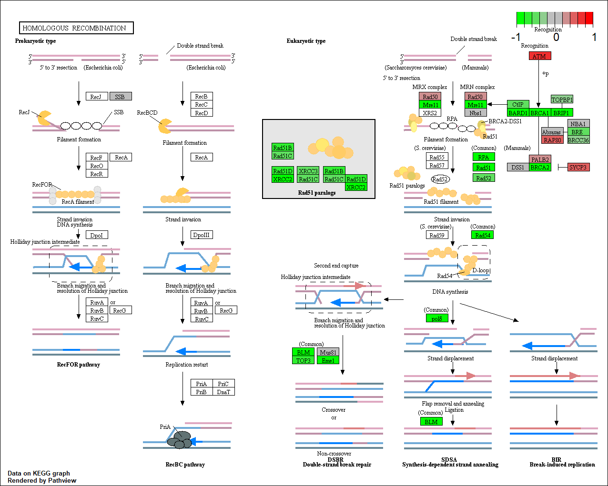
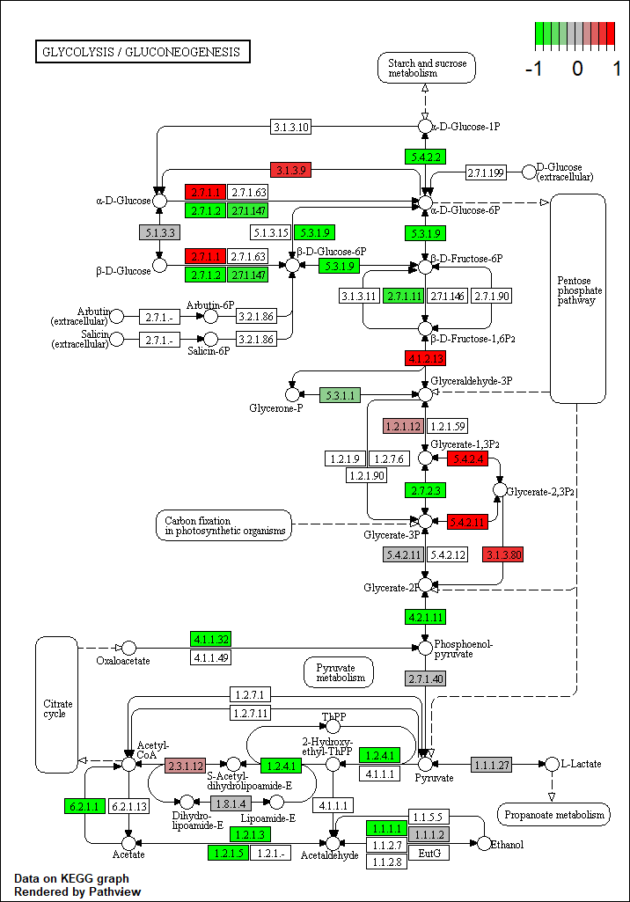

```{r setup, include=FALSE}
knitr::opts_chunk$set(echo = TRUE)
```

## RNA-Seq Analysis

The data for for hands-on session comes from GEO entry: GSE37704, which is associated with the following publication:
Trapnell C, Hendrickson DG, Sauvageau M, Goff L et al. "Differential analysis of gene regulation at transcript resolution with RNA-seq". Nat Biotechnol 2013 Jan;31(1):46-53. PMID: 23222703

```{r}
library(DESeq2)

metaFile <- "GSE37704_metadata.csv"
countFile <- "GSE37704_featurecounts.csv"
```

# Import metadata and take a peak
```{r}
colData = read.csv(metaFile, row.names=1)
head(colData)
```

# Import countdata
```{r}
countData = read.csv(countFile, row.names=1)
head(countData)
```

# The data above are a problem because we need the countData and colData files to match up so we will need to remove that odd first column in countData namely contData$length.


```{r}
# Note we need to remove the odd first $length col

#Also  note that if we keep running this code, we'll be dropping off the first column every single time. This means we want to be careful this code is only run once!

countData <- as.matrix(countData[,-1])

head(countData)
```

# This looks better but there are lots of zero entries in there so let's get rid of them as we have no data for these.

```{r}
# Filter count data where you have 0 read count across all samples, i.e. we want to remove rows with 0 values for all experiments.

nonzero.rows <- rowSums(countData) != 0

countData <- countData[nonzero.rows,]

nrow(countData)
```

##Running DESeq2

Nice now lets setup the DESeqDataSet object required for the DESeq() function and then run the DESeq pipeline. This is again similar to our last days hands-on session.

```{r}
dds = DESeqDataSetFromMatrix(countData=countData,
                             colData=colData,
                             design=~condition)

dds = DESeq(dds)
```

Let's look at dds now.
```{r}
dds
```

Next, get results for the HoxA1 knockdown versus control siRNA (remember that these were labeled as "hoxa1_kd" and "control_sirna" in our original colData metaFile input to DESeq, you can check this above and by running resultsNames(dds) command).

```{r}
res = results(dds, contrast=c("condition", "hoxa1_kd", "control_sirna"))
```

> Q. Call the summary() function on your results to get a sense of how many genes are up or down-regulated at the default 0.1 p-value cutoff. ANSWER: Based off below, 27% are up regulated and 28% are down-regulated.

```{r}
summary(res)
```

## Now, let's make a volcano plot to see which genes are significantly different, and we will focus on those for our subsequent analysis:

```{r}
plot( res$log2FoldChange, -log(res$padj) )

```

This is challenging to read, so we will make some formating adjustments to enhance visual interpretation.

```{r}
# Make a color vector for all genes
mycols <- rep("gray", nrow(res) )

# Color red the genes with absolute fold change above 2
mycols[ abs(res$log2FoldChange) > 2 ] <- "red"

# Color blue those with adjusted p-value less than 0.01 and absolute fold change more than 2
inds <- (res$padj < .01) & (abs(res$log2FoldChange) > 2 )

mycols[ inds ] <- "blue"

plot( res$log2FoldChange, -log(res$padj), col=mycols, xlab="Log2(FoldChange)", ylab="-Log(P-value)" )
```

## Add gene annotation
>Q. Use the mapIDs() function multiple times to add SYMBOL, ENTREZID and GENENAME annotation to our results by completing the code below.

```{r}
library("AnnotationDbi")
library("org.Hs.eg.db")

columns(org.Hs.eg.db)

res$symbol = mapIds(org.Hs.eg.db,
                    keys=row.names(res), 
                    keytype="ENSEMBL",
                    column="SYMBOL",
                    multiVals="first")

res$entrez = mapIds(org.Hs.eg.db,
                    keys=row.names(res),
                    keytype="ENSEMBL",
                    column="ENTREZID",
                    multiVals="first")

res$name =   mapIds(org.Hs.eg.db,
                    keys=row.names(res),
                    keytype="ENSEMBL",
                    column="UNIGENE",
                    multiVals="first")

head(as.data.frame(res))
```

>Q. Finally for this section let's reorder these results by adjusted p-value and save them to a CSV file in your current project directory.

```{r}
res = res[order(res$pvalue),]
write.csv(res, file="deseq_results.csv")
```

## Section 2. Pathway Analysis
Here we are going to use the gage package for pathway analysis. Once we have a list of enriched pathways, we're going to use the pathview package to draw pathway diagrams, shading the molecules in the pathway by their degree of up/down-regulation.

First, we installed the following package via our console:

BiocManager::install( c("pathview", "gage", "gageData") )

Now we can load the packages and setup the KEGG data-sets we need.

```{r}
library(pathview)
library(gage)
library(gageData)
```

Note: Kegg - Kyoto Encyclopedia of Gene

BiocManager::install( c("pathview", "gage", "gageData") )
```{r}
library(gage)
library(gageData)

data(kegg.sets.hs)
data(sigmet.idx.hs)

# Focus on signaling and metabolic pathways only
kegg.sets.hs = kegg.sets.hs[sigmet.idx.hs]

# Examine the first 3 pathways
head(kegg.sets.hs, 3)
```

# So we have seen these pathways, but now we want to evaluate if any of these are enriched in our data sample.

```{r}
foldchanges = res$log2FoldChange
names(foldchanges) = res$entrez
head(foldchanges)
```

Now, let’s run the gage pathway analysis.
```{r}
# Get the results
keggres = gage(foldchanges, gsets=kegg.sets.hs)
```

Now lets look at the object returned from gage().

```{r}
attributes(keggres)
```

# Look at the first few down (less) pathways
```{r}
head(keggres$less)
```

Each "keggres$less" and keggres$greater object is data matrix with gene sets as rows sorted by p-value.
The top "less/down" pathways is "Cell cycle" with the KEGG pathway identifier hsa04110.
Now, let's try out the pathview() function from the pathview package to make a pathway plot with our RNA-Seq expression results shown in color.
To begin with lets manually supply a pathway.id (namely the first part of the "hsa04110 Cell cycle") that we could see from the print out above.


#This is the cell cycle! Anything that's not colored will be genes that are not found in my data set. The intensity of color indicates how much it's changed. Green means up regulated and red means down regulated.
```{r}
pathview(gene.data=foldchanges, pathway.id="hsa04110")

```


#Let's explore a couple of the other pathways that are affected
```{r}
pathview(gene.data=foldchanges, pathway.id="hsa03030")
```
DNA Replication


```{r}
pathview(gene.data=foldchanges, pathway.id="hsa03013")
```
RNA Transport


```{r}
pathview(gene.data=foldchanges, pathway.id="hsa03440")
```
Homologous Recombination



```{r}
pathview(gene.data=foldchanges, pathway.id="hsa04114")
```
Oocyte meiosis


```{r}
pathview(gene.data=foldchanges, pathway.id="hsa00010")
```
Glycolysis / Gluconeogenesis


##Section 3. Gene Ontology (GO)

So now we are going to do the exact same thing, but our reference data will be GO instead of Gage. The difference here is that the information will be less visual but additional textbook information.

```{r}
data(go.sets.hs)
data(go.subs.hs)

# Focus on Biological Process subset of GO
gobpsets = go.sets.hs[go.subs.hs$BP]

gobpres = gage(foldchanges, gsets=gobpsets, same.dir=TRUE)

lapply(gobpres, head)
```

## Section 4. Reactome Analysis
```{r}
sig_genes <- res[res$padj <= 0.05 & !is.na(res$padj), "symbol"]
print(paste("Total number of significant genes:", length(sig_genes)))
```

```{r}
write.table(sig_genes, file="significant_genes.txt", row.names=FALSE, col.names=FALSE, quote=FALSE)
```

Then, to perform pathway analysis online go to the Reactome website (https://reactome.org/PathwayBrowser/#TOOL=AT). Select “choose file” to upload your significant gene list. Then, select the parameters “Project to Humans”, then click “Analyze”.

> Q: What pathway has the most significant “Entities p-value”? Do the most significant pathways listed match your previous KEGG results? What factors could cause differences between the two methods?

The most significant pathways are 
Endosomal/Vacuolar pathway
Antigen Presentation: Folding, assembly and peptide loading of class I MHC
Amplification of signal from unattached kinetochores via a MAD2 inhibitory signal

NOTE: Thesea re NOT the same pathways that were listed in our KEGG results.

The reason for these differences is that different tools use different methods to arrive at their conclusions, which can cause discrepanices in the final results of each method.

##Section 5: Section 5. GO online (OPTIONAL)

Gene Set Gene Ontology (GO) Enrichment is a method to determine over-represented or under-represented GO terms for a given set of genes. GO terms are formal structured controlled vocabularies (ontologies) for gene products in terms of their biological function. The goal of this analysis is to determine the biological process the given set of genes are associated with.
To perform Gene Set GO Enrichment online go to the website http://www.geneontology.org/page/go-enrichment-analysis. Paste your significant gene list from section 4. Then, select "biological process" and "homo sapiens", and click submit.

>Q: What pathway has the most significant “Entities p-value”? Do the most significant pathways listed match your previous KEGG results? What factors could cause differences between the two methods?

negative regulation of DNA-dependent DNA replication 
CENP-A containing nucleosome assembly 
nuclear DNA replication 
