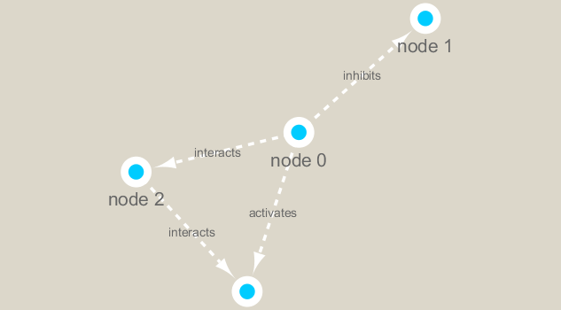

```{r setup, include=FALSE}
knitr::opts_chunk$set(echo = TRUE)
```

## Set up Cytoscape and R connection

We will use the **RCy3** and **igraph** package in this class. The first is from bioconductor, and the second is from CRAN.

First, let's do a couple steps to make sure that we have the tools ready to go that we will need for the remainder of this exercise. 

```{r}
library(RCy3)

# Test the connection to Cytoscape.
cytoscapePing()
```


```{r}
# Check the version
cytoscapeVersionInfo()
```

We can test things further by making a small network (here in igraph format as used by the R igraph package) and sending it to Cytoscape:

```{r}
g <- makeSimpleIgraph()
createNetworkFromIgraph(g,"myGraph")
setVisualStyle("Marquee")
```

Note: Our test was successful! We had the following graph populated into our Cytoscape instance.

```{r}
fig <- exportImage(filename="demo_marquee", type="png", height=350)



```

## Now that we have done some basics, we will beging to **Read our metagenomics data**

```{r}
## scripts for processing located in "inst/data-raw/"
prok_vir_cor <- read.delim("virus_prok_cor_abundant.tsv", stringsAsFactors = FALSE)

## Have a peak at the first 6 rows
head(prok_vir_cor)
```

# Now, we will use **iGraph**convert the co-occurrence dataframe into a network that we can send to Cytoscape. In this case our graph is undirected (so we will set directed = FALSE) since we do not have any information about the direction of the interactions from this type of data.

```{r}
g <- graph.data.frame(prok_vir_cor, directed = FALSE)
```

Now, as a little qc measure, we will an check the class of our new object g and see that is is of class igraph. Therefor the print.igraph() function will be called when we type it's name allowing us have an informative overview of the graph structure.

```{r}
class(g)
```

Let's see what happens when we just go ahead and plot what we have so far:
```{r}
plot(g)
```

This is very noisy, so we are going to make a few formatting changes to make for some easier analysis. Let's just inspect exactly what we've got at this point.

```{r}
g
```

In this case the first line of output ("UNW- 854 1544 --") tells that our network graph has 845 vertices (i.e. nodes, which represent our bacteria and viruses) and 1544 edges (i.e. linking lines, which indicate their co-occurrence). Note that the first four characters (i.e. the "UNW-" part) tell us about the network setup. In this case our network is Undirected, Named (i.e. has the 'name' node/vertex attribute set) and Weighted (i.e. the 'weight' edge attribute is set).

We'll start cleaning this up first by removing the text labels.
```{r}
plot(g, vertex.label=NA)
```

The nodes/vertex are too big. Lets make them smaller...

```{r}
plot(g, vertex.size=3, vertex.label=NA)
```

u can also use the ggplot extension package for networks called ggraph. You will likely have to run install.packages("ggraph") the first time you run the below code if you have not already install the package:
```{r}
library("ggraph")
```

Using 'nicely' as default layout:
```{r}
ggraph(g, layout = 'auto') +
  geom_edge_link(alpha = 0.25) +
  geom_node_point(color="steelblue") +
  theme_graph()
```

Now, we will send this to Cytoscape!
```{r}
createNetworkFromIgraph(g,"myIgraph")
```


Note that we can query (and set) vertex and edge attributes with the V() and E() functions respectively:
```{r}
V(g)
```


```{r}
E(g)
```


##Clustering our data

```{r}
cb <- cluster_edge_betweenness(g)

```

```{r}
cb
```

```{r}
plot(cb, y=g, vertex.label=NA,  vertex.size=3)


```

You can extract a cluster/community membership vector for further inspection with the membership() function:
```{r}
head( membership(cb) )
```

# Calculate and plot node degree of our network
```{r}
d <- degree(g)

hist(d, breaks=30, col="lightblue", main ="Node Degree Distribution")
```

```{r}
plot( degree_distribution(g), type="h" )

```

##Centrality analysis
Centrality gives an estimation on how important a node or edge is for the connectivity (or the information flow) of a network. It is a particularly useful parameter in signaling networks and it is often used when trying to find drug targets for example.

Centrality analysis often aims to answer the following question: Which nodes are the most important and why?

One centrality method that you can often find in publications is the Google PageRank score.
```{r}
pr <- page_rank(g)
head(pr$vector)
```

Lets plot our network with nodes size scaled via this page rank centrality scores.
```{r}
# Make a size vector btwn 2 and 20 for node plotting size

v.size <- BBmisc::normalize(pr$vector, range=c(2,20), method="range")
plot(g, vertex.size=v.size, vertex.label=NA)
```

One of the simplest centrality scores is of course degree that we calculated previously and stored as the object d. Lets plot this one out also

```{r}
v.size <- BBmisc::normalize(d, range=c(2,20), method="range")
plot(g, vertex.size=v.size, vertex.label=NA)
```

Another very common centrality score is betweenness. The vertex and edge betweenness are (roughly) defined by the number of geodesics (shortest paths) going through a vertex or an edge.
```{r}
b <- betweenness(g)
v.size <- BBmisc::normalize(b, range=c(2,20), method="range")
plot(g, vertex.size=v.size, vertex.label=NA)
```

## Read taxonomic classification for network annotation.

```{r}
phage_id_affiliation <- read.delim("phage_ids_with_affiliation.tsv")
head(phage_id_affiliation)
```

Do the same thing to get our bacteria data uploaded:
```{r}
bac_id_affi <- read.delim("prok_tax_from_silva.tsv", stringsAsFactors = FALSE)
head(bac_id_affi)
```

In preparation for sending the networks to Cytoscape we will add in the taxonomic data.
```{r}
## Extract out our vertex names
genenet.nodes <- as.data.frame(vertex.attributes(g), stringsAsFactors=FALSE)
head(genenet.nodes)
```

How may phage (i.e. ph_) entries do we have?
```{r}
length( grep("^ph_",genenet.nodes[,1]) ) 
```

Therefore we have 81 non phage nodes.

Now lets **merge()** these with the annotation data

```{r}
# We dont need all annotation data so lets make a reduced table 'z' for merging
z <- bac_id_affi[,c("Accession_ID", "Kingdom", "Phylum", "Class")]

n <- merge(genenet.nodes, z, by.x="name", by.y="Accession_ID", all.x=TRUE)
head(n)
```

```{r}

# Check on the column names before deciding what to merge
colnames(n)
```

```{r}
colnames(phage_id_affiliation)
```

```{r}
# Again we only need a subset of `phage_id_affiliation` for our purposes
y <- phage_id_affiliation[, c("first_sheet.Phage_id_network", "phage_affiliation","Tax_order", "Tax_subfamily")]

# Add the little phage annotation that we have
x <- merge(x=n, y=y, by.x="name", by.y="first_sheet.Phage_id_network", all.x=TRUE)

## Remove duplicates from multiple matches
x <- x[!duplicated( (x$name) ),]
head(x)
```

Save our merged annotation results back to genenet.nodes.
```{r}
genenet.nodes <- x
```

## Send network to Cytoscape using RCy3
