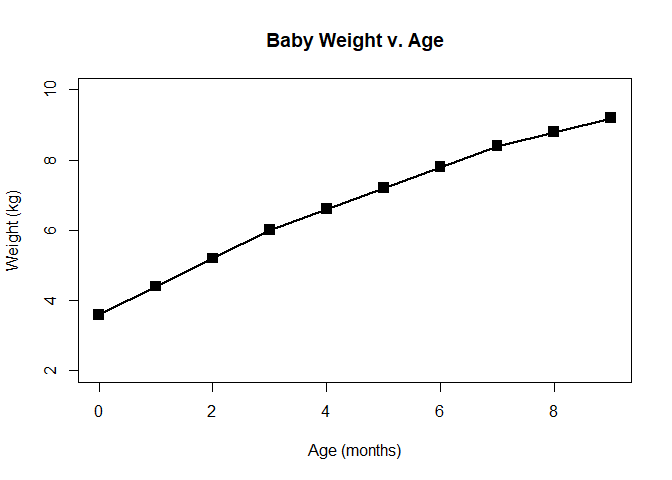
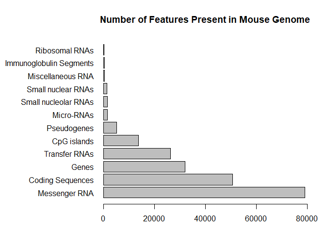
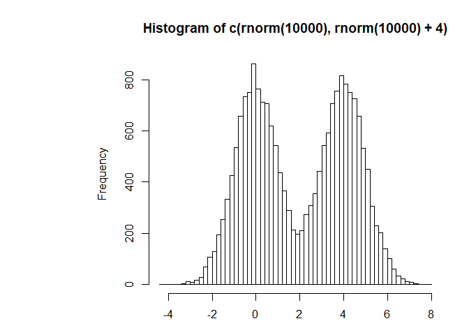
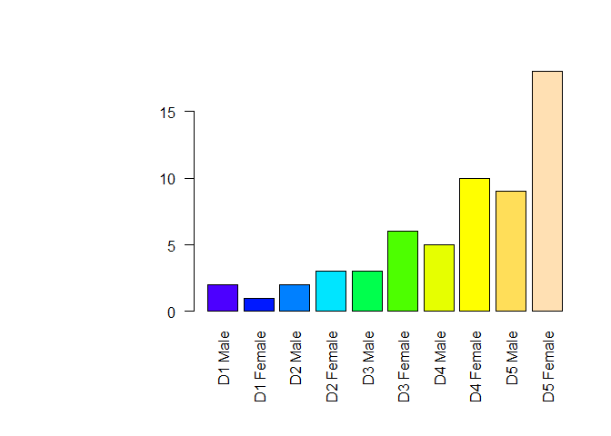

Class 5 - Graphics in R
================
Tyler Bogan
May 2, 2019

R Markdown
----------

``` r
# title: "Class 5 - Graphics in R"
# author: "Tyler Bogan"
# date: "16 April 2019"
# ---
# 

# Class 5 R graphics

# Line Plot

weight <- read.table("bimm143_05_rstats/weight_chart.txt", header=TRUE)

plot(weight$Age,weight$Weight, typ="o",
     pch=15, cex=1.5, lwd=2, ylim=c(2,10),
     xlab="Age (months)", ylab="Weight (kg)",
     main="Baby Weight v. Age"
     )
```



``` r
# Bar Plot

mouse <- read.table("bimm143_05_rstats/feature_counts.txt", sep="\t", header=TRUE)

par(mar=c(3.1, 11.1, 4.1, 2))

barplot(mouse$Count, names.arg=mouse$Feature,
        horiz=TRUE, ylab=" ",las=1, 
        xlim=c(0,80000),
        main="Number of Features Present in Mouse Genome")
```



``` r
# Histograms

hist(c(rnorm(10000), rnorm(10000)+4), breaks=65)
```



``` r
# Color 

par(mar=c(7, 11.1, 4.1, 2))

mfcounts <- read.delim("bimm143_05_rstats/male_female_counts.txt")

barplot(mfcounts$Countssss, names.arg = mfcounts$Sample, las=2,
        col=topo.colors(10))
```


