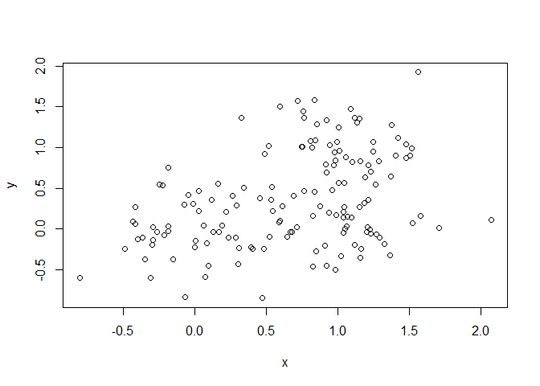

Class-8: Machine Learning
================
Tyler Bogan
April 25, 2019

We are going to explore the **kmeans()** function which helps deterimine clusters of similar data. First, we're going to input some data to work with.
======================================================================================================================================================

``` r
tmp <- c(rnorm(30,-3), rnorm(30,3))

x <- cbind(x=tmp, y=rev(tmp))

plot(x)
```


We see that a plot is generated; to me, it looks like we are going to end up with two primary groupings. Let's run the function to see if that's correct!
=========================================================================================================================================================

Running Kmeans & saving it as an object to save ourselves time later.
---------------------------------------------------------------------

``` r
kmeans(x, centers = 2, nstart = 20)
```

    ## K-means clustering with 2 clusters of sizes 30, 30
    ## 
    ## Cluster means:
    ##           x         y
    ## 1 -2.863480  3.112445
    ## 2  3.112445 -2.863480
    ## 
    ## Clustering vector:
    ##  [1] 1 1 1 1 1 1 1 1 1 1 1 1 1 1 1 1 1 1 1 1 1 1 1 1 1 1 1 1 1 1 2 2 2 2 2
    ## [36] 2 2 2 2 2 2 2 2 2 2 2 2 2 2 2 2 2 2 2 2 2 2 2 2 2
    ## 
    ## Within cluster sum of squares by cluster:
    ## [1] 50.20133 50.20133
    ##  (between_SS / total_SS =  91.4 %)
    ## 
    ## Available components:
    ## 
    ## [1] "cluster"      "centers"      "totss"        "withinss"    
    ## [5] "tot.withinss" "betweenss"    "size"         "iter"        
    ## [9] "ifault"

``` r
km <- kmeans(x, centers = 2, nstart = 20)
```

Now that we have performed the function, Dr. Grant would like us to answer the following:
=========================================================================================

> Q. How many points are in each cluster? There are 30 in each cluster because that's what we asked for in rnorm.

> Q. What ‘component’ of your result object details - cluster size? This is listed in the very first line of the output. - cluster assignment/membership? This is lsited in 'Clustering Vector' - cluster center? This is listed under 'Cluster Means'

> Plot x colored by the kmeans cluster assignment and add cluster centers as blue points

We were able to answer everything except the last point about the plot. Let's work on that next! We just define color as the vector km (defined earlier) and restrict to the 'cluster values. This will assign different colors to each of our x values, based on which cluster the computer assigned them to. We'll add this 'points' function too which will show us the centers of our clusters.
===================================================================================================================================================================================================================================================================================================================================================================================================

``` r
plot(x, col=km$cluster)
points(km$centers, pch=18, col="blue", cex=3)
```


Now we are going to try using the **hclust()** functions wit the same data! We must give this function a distance matrix not the raw data as input. Our output of the code below is a **dendrogram**. We are using **abline()** to add a line for easier analysis. Or we can just cut it using \*\*cutree()\*
-------------------------------------------------------------------------------------------------------------------------------------------------------------------------------------------------------------------------------------------------------------------------------------------------------------

``` r
d <- dist(x)

hc <- hclust(d)

plot(hc)

abline(h=6, col="red")
```


``` r
cutree(hc, k=2)
```

    ##  [1] 1 1 1 1 1 1 1 1 1 1 1 1 1 1 1 1 1 1 1 1 1 1 1 1 1 1 1 1 1 1 2 2 2 2 2
    ## [36] 2 2 2 2 2 2 2 2 2 2 2 2 2 2 2 2 2 2 2 2 2 2 2 2 2

What do you notice? It's showing us two groups of 30 and how the computer has split these random points into two different groups, and then sub-ranked them even further.
=========================================================================================================================================================================

Does the dendrogram make sense based on your knowledge of x? Yes - we have half our values centered in two different clusters!
==============================================================================================================================

Now, we are going to use some of our techniques on a more complex set of data. Let's create that data now!
----------------------------------------------------------------------------------------------------------

``` r
# Step 1. Generate some example data for clustering

x <- rbind(
 matrix(rnorm(100, mean=0, sd = 0.3), ncol = 2), # c1
 matrix(rnorm(100, mean = 1, sd = 0.3), ncol = 2), # c2
 matrix(c(rnorm(50, mean = 1, sd = 0.3), # c3
  rnorm(50, mean = 0, sd = 0.3)), ncol = 2))

colnames(x) <- c("x", "y")

# Step 2. Plot the data without clustering
plot(x)
```



``` r
# Step 3. Generate colors for known clusters
#   (just so we can compare to hclust results)
col <- as.factor( rep(c("c1","c2","c3"), each=50) )

plot(x, col=col)
```


With this data we ahve created, our task is to use our hierarchical clustering technique to try and separate these into three different groups.
-----------------------------------------------------------------------------------------------------------------------------------------------

``` r
d2 <- dist(x)

hc2 <- hclust(d2)

plot(hc2)

cutree(hc2, k = 2)
```

    ##   [1] 1 1 1 1 1 1 1 1 1 1 1 1 2 1 1 1 1 1 1 1 2 1 1 1 1 1 1 1 1 1 1 1 1 1 1
    ##  [36] 1 1 1 1 1 1 1 1 1 1 1 1 1 1 1 2 2 2 2 2 2 2 2 2 2 2 2 2 2 2 2 2 2 2 2
    ##  [71] 2 2 2 2 2 2 2 2 2 2 2 2 2 2 2 2 2 2 2 2 2 2 2 2 2 2 2 2 2 2 2 2 1 2 2
    ## [106] 2 2 2 2 2 2 2 2 2 2 2 2 2 1 2 2 2 2 2 2 2 2 2 2 2 2 2 2 2 2 2 2 2 2 2
    ## [141] 2 2 2 2 2 2 2 2 2 2

``` r
abline(h=2, col="red")

abline(h=2.8, col="blue")
```


Now we will use **cutree()** to see if our results make sense. Let's cut our data in two ways - first into two groupings, next into three groupings
===================================================================================================================================================

``` r
gp2 <- cutree(hc2, k = 2)

gp3 <- cutree(hc2, k = 3)
```

Now let's look gp2.
===================

``` r
gp2
```

    ##   [1] 1 1 1 1 1 1 1 1 1 1 1 1 2 1 1 1 1 1 1 1 2 1 1 1 1 1 1 1 1 1 1 1 1 1 1
    ##  [36] 1 1 1 1 1 1 1 1 1 1 1 1 1 1 1 2 2 2 2 2 2 2 2 2 2 2 2 2 2 2 2 2 2 2 2
    ##  [71] 2 2 2 2 2 2 2 2 2 2 2 2 2 2 2 2 2 2 2 2 2 2 2 2 2 2 2 2 2 2 2 2 1 2 2
    ## [106] 2 2 2 2 2 2 2 2 2 2 2 2 2 1 2 2 2 2 2 2 2 2 2 2 2 2 2 2 2 2 2 2 2 2 2
    ## [141] 2 2 2 2 2 2 2 2 2 2

Now let's look at gp 3
======================

``` r
gp3
```

    ##   [1] 1 1 1 1 1 1 1 1 1 1 1 1 2 1 1 1 1 1 1 1 2 1 1 1 1 1 1 1 1 1 1 1 1 1 1
    ##  [36] 1 1 1 1 1 1 1 1 1 1 1 1 1 1 1 3 3 3 3 3 3 2 3 3 3 3 3 3 3 3 3 3 3 3 3
    ##  [71] 3 3 3 3 3 3 3 3 2 3 3 3 3 3 3 3 3 3 3 3 3 3 3 3 3 3 3 3 3 3 2 2 1 2 2
    ## [106] 2 2 2 2 2 2 3 2 2 3 2 2 2 1 2 2 2 2 2 2 2 3 2 2 2 2 2 2 2 2 2 2 2 2 2
    ## [141] 2 2 2 3 2 3 2 2 2 2

Now let's plot both
-------------------

``` r
plot(x, col=gp2)
```


``` r
plot(x, col=gp3)
```


Principal Component Analysis
----------------------------

First, let's give ourselves some data to work with.
===================================================

``` r
mydata <- read.csv("https://tinyurl.com/expression-CSV",
 row.names=1) 
```

Let's find out how many genes & how many experiments we have
============================================================

``` r
nrow(mydata) #this is our number of genes
```

    ## [1] 100

``` r
ncol(mydata) #this is our number of expt's
```

    ## [1] 10

Now let's go ahead and start our PCA analysis!
==============================================

``` r
pca <- prcomp( t(mydata), scale=TRUE )
```

``` r
## A basic PC1 vs PC2 2-D plot
plot(pca$x[,1], pca$x[,2]) 
```


``` r
## Precent variance is often more informative to look at
pca.var <- pca$sdev^2

pca.var.per <- round(pca.var/sum(pca.var)*100, 1) # We can see that 92.6% of our variance is in our component one. This is definitely our prinicipal component!

#We can make a graph to just double check ourselves. when our variance isn't so major, this will be important.
barplot(pca.var.per, main="Scree Plot",
 xlab="Principal Component", ylab="Percent Variation")
```


Let's go back to our plot and make it just a tad fancier!
---------------------------------------------------------

``` r
## A vector of colors for wt and ko samples
colvec <- colnames(mydata)
colvec[grep("wt", colvec)] <- "red"
colvec[grep("ko", colvec)] <- "blue"
plot(pca$x[,1], pca$x[,2], col=colvec, pch=16,
 xlab=paste0("PC1 (", pca.var.per[1], "%)"),
 ylab=paste0("PC2 (", pca.var.per[2], "%)"))
```


Project on UK food data analysis
--------------------------------

First let's get some data!
==========================

``` r
x <- read.csv("https://bioboot.github.io/bggn213_f17/class-material/UK_foods.csv")
```

Let's find out how many rows & columns we're working with
=========================================================

``` r
nrow(x)
```

    ## [1] 17

``` r
ncol(x)
```

    ## [1] 5

Looking a the first six rows

``` r
head(x)
```

    ##                X England Wales Scotland N.Ireland
    ## 1         Cheese     105   103      103        66
    ## 2  Carcass_meat      245   227      242       267
    ## 3    Other_meat      685   803      750       586
    ## 4           Fish     147   160      122        93
    ## 5 Fats_and_oils      193   235      184       209
    ## 6         Sugars     156   175      147       139

But I want the food stuff as my row names

``` r
x <- read.csv("https://bioboot.github.io/bggn213_f17/class-material/UK_foods.csv", row.names=1)

ncol(x) #Notice that our numer of columns has decreased now that we have extracted one of them as our row names.
```

    ## [1] 4

Awesome - ow let's make a barplot of our data!

``` r
barplot(as.matrix(x), beside=T, col=rainbow(nrow(x)))
```


Well that's very pretty - let's see if we can find something a little more useful!

``` r
barplot(as.matrix(x), beside=F, col=rainbow(nrow(x)))
```


Now let's see what happens with this code we have been provided:

``` r
pairs(x, col=rainbow(10), pch=16) #This shows that Ireleand is the least similar of the countries.
```


That graph includes super useful data, but it's hard to get that data jsut from looking at it. Therefore, we're going to turn to PCA!
-------------------------------------------------------------------------------------------------------------------------------------

``` r
#prcomp() expects the observations to be rows and the variables to be columns therefore we need to first transpose our data.frame matrix with the t() transpose function.

# Use the prcomp() PCA function 
pca <- prcomp( t(x) )

summary(pca)
```

    ## Importance of components:
    ##                             PC1      PC2      PC3       PC4
    ## Standard deviation     324.1502 212.7478 73.87622 4.189e-14
    ## Proportion of Variance   0.6744   0.2905  0.03503 0.000e+00
    ## Cumulative Proportion    0.6744   0.9650  1.00000 1.000e+00

From the info above, we see that PC1 accounts for most of the difference, and PC4 accounts for none of the difference.
======================================================================================================================

Now let's plot our PCA data we've created!
==========================================

``` r
plot(pca$x[,1], pca$x[,2], xlab="PC1", ylab="PC2", xlim=c(-270,500))
text(pca$x[,1], pca$x[,2], colnames(x))
```


Let's make some colors!!!!!!
============================

``` r
plot(pca$x[,1], pca$x[,2], xlab="PC1", ylab="PC2", xlim=c(-270,500))
text(pca$x[,1], pca$x[,2], colnames(x))
```


Let's go ahead and assess the difference of foods consumed by country:
======================================================================

``` r
par(mar=c(10, 3, 0.35, 0))
barplot( pca$rotation[,1], las=2 )
```


