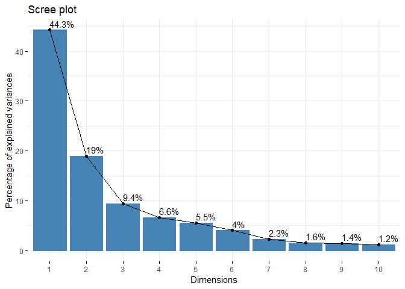

Class-9: Hands on Session - Breast Cancer Analysis
================
Tyler Bogan
April 30, 2019

First, we need data to input:

``` r
wisc.df <- read.csv("WisconsinCancer.csv")
```

Next, we will convert it to matrix:

``` r
wisc.data <- as.matrix(wisc.df[,3:32])
```

Set the row names of wisc.data
==============================

``` r
row.names(wisc.data) <- wisc.df$id
```

Create diagnosis vector by completing the missing code. 1 = cancer, 0 = no cancer
=================================================================================

``` r
diagnosis <- as.numeric(wisc.df$diagnosis == "M")
```

Convert Q1. How many observations are in this dataset?

``` r
nrow(wisc.df)
```

    ## [1] 569

Q2. How many variables/features in the data are suffixed with \_mean?

``` r
#You see there are a lot of 'means'
colnames(wisc.data)
```

    ##  [1] "radius_mean"             "texture_mean"           
    ##  [3] "perimeter_mean"          "area_mean"              
    ##  [5] "smoothness_mean"         "compactness_mean"       
    ##  [7] "concavity_mean"          "concave.points_mean"    
    ##  [9] "symmetry_mean"           "fractal_dimension_mean" 
    ## [11] "radius_se"               "texture_se"             
    ## [13] "perimeter_se"            "area_se"                
    ## [15] "smoothness_se"           "compactness_se"         
    ## [17] "concavity_se"            "concave.points_se"      
    ## [19] "symmetry_se"             "fractal_dimension_se"   
    ## [21] "radius_worst"            "texture_worst"          
    ## [23] "perimeter_worst"         "area_worst"             
    ## [25] "smoothness_worst"        "compactness_worst"      
    ## [27] "concavity_worst"         "concave.points_worst"   
    ## [29] "symmetry_worst"          "fractal_dimension_worst"

``` r
#grep fxn searches column names. This spits out the columns which end in _mean
grep("_mean", colnames(wisc.data))
```

    ##  [1]  1  2  3  4  5  6  7  8  9 10

``` r
#find the number of these total to answer our question
length(grep("_mean", colnames(wisc.data)))
```

    ## [1] 10

Q3. How many of the observations have a malignant diagnosis

``` r
table(wisc.df$diagnosis)
```

    ## 
    ##   B   M 
    ## 357 212

``` r
round(apply(wisc.data,2,sd))
```

    ##             radius_mean            texture_mean          perimeter_mean 
    ##                       4                       4                      24 
    ##               area_mean         smoothness_mean        compactness_mean 
    ##                     352                       0                       0 
    ##          concavity_mean     concave.points_mean           symmetry_mean 
    ##                       0                       0                       0 
    ##  fractal_dimension_mean               radius_se              texture_se 
    ##                       0                       0                       1 
    ##            perimeter_se                 area_se           smoothness_se 
    ##                       2                      45                       0 
    ##          compactness_se            concavity_se       concave.points_se 
    ##                       0                       0                       0 
    ##             symmetry_se    fractal_dimension_se            radius_worst 
    ##                       0                       0                       5 
    ##           texture_worst         perimeter_worst              area_worst 
    ##                       6                      34                     569 
    ##        smoothness_worst       compactness_worst         concavity_worst 
    ##                       0                       0                       0 
    ##    concave.points_worst          symmetry_worst fractal_dimension_worst 
    ##                       0                       0                       0

Next, we are conducting **Principal Component Analysis (PCA)**
--------------------------------------------------------------

Check the mean and standard deviation of the features (i.e. columns) of the wisc.data to determine if the data should be scaled. Use the colMeans() and apply() functions like you’ve done before.

``` r
# Check column means and standard deviations
colMeans(wisc.data)
```

    ##             radius_mean            texture_mean          perimeter_mean 
    ##            1.412729e+01            1.928965e+01            9.196903e+01 
    ##               area_mean         smoothness_mean        compactness_mean 
    ##            6.548891e+02            9.636028e-02            1.043410e-01 
    ##          concavity_mean     concave.points_mean           symmetry_mean 
    ##            8.879932e-02            4.891915e-02            1.811619e-01 
    ##  fractal_dimension_mean               radius_se              texture_se 
    ##            6.279761e-02            4.051721e-01            1.216853e+00 
    ##            perimeter_se                 area_se           smoothness_se 
    ##            2.866059e+00            4.033708e+01            7.040979e-03 
    ##          compactness_se            concavity_se       concave.points_se 
    ##            2.547814e-02            3.189372e-02            1.179614e-02 
    ##             symmetry_se    fractal_dimension_se            radius_worst 
    ##            2.054230e-02            3.794904e-03            1.626919e+01 
    ##           texture_worst         perimeter_worst              area_worst 
    ##            2.567722e+01            1.072612e+02            8.805831e+02 
    ##        smoothness_worst       compactness_worst         concavity_worst 
    ##            1.323686e-01            2.542650e-01            2.721885e-01 
    ##    concave.points_worst          symmetry_worst fractal_dimension_worst 
    ##            1.146062e-01            2.900756e-01            8.394582e-02

``` r
apply(wisc.data,2,sd)
```

    ##             radius_mean            texture_mean          perimeter_mean 
    ##            3.524049e+00            4.301036e+00            2.429898e+01 
    ##               area_mean         smoothness_mean        compactness_mean 
    ##            3.519141e+02            1.406413e-02            5.281276e-02 
    ##          concavity_mean     concave.points_mean           symmetry_mean 
    ##            7.971981e-02            3.880284e-02            2.741428e-02 
    ##  fractal_dimension_mean               radius_se              texture_se 
    ##            7.060363e-03            2.773127e-01            5.516484e-01 
    ##            perimeter_se                 area_se           smoothness_se 
    ##            2.021855e+00            4.549101e+01            3.002518e-03 
    ##          compactness_se            concavity_se       concave.points_se 
    ##            1.790818e-02            3.018606e-02            6.170285e-03 
    ##             symmetry_se    fractal_dimension_se            radius_worst 
    ##            8.266372e-03            2.646071e-03            4.833242e+00 
    ##           texture_worst         perimeter_worst              area_worst 
    ##            6.146258e+00            3.360254e+01            5.693570e+02 
    ##        smoothness_worst       compactness_worst         concavity_worst 
    ##            2.283243e-02            1.573365e-01            2.086243e-01 
    ##    concave.points_worst          symmetry_worst fractal_dimension_worst 
    ##            6.573234e-02            6.186747e-02            1.806127e-02

Perform PCA on wisc.data by completing the following code
=========================================================

``` r
wisc.pr <- prcomp(wisc.data, scale=TRUE)
```

Look at the summary of the results:
===================================

``` r
summary(wisc.pr)
```

    ## Importance of components:
    ##                           PC1    PC2     PC3     PC4     PC5     PC6
    ## Standard deviation     3.6444 2.3857 1.67867 1.40735 1.28403 1.09880
    ## Proportion of Variance 0.4427 0.1897 0.09393 0.06602 0.05496 0.04025
    ## Cumulative Proportion  0.4427 0.6324 0.72636 0.79239 0.84734 0.88759
    ##                            PC7     PC8    PC9    PC10   PC11    PC12
    ## Standard deviation     0.82172 0.69037 0.6457 0.59219 0.5421 0.51104
    ## Proportion of Variance 0.02251 0.01589 0.0139 0.01169 0.0098 0.00871
    ## Cumulative Proportion  0.91010 0.92598 0.9399 0.95157 0.9614 0.97007
    ##                           PC13    PC14    PC15    PC16    PC17    PC18
    ## Standard deviation     0.49128 0.39624 0.30681 0.28260 0.24372 0.22939
    ## Proportion of Variance 0.00805 0.00523 0.00314 0.00266 0.00198 0.00175
    ## Cumulative Proportion  0.97812 0.98335 0.98649 0.98915 0.99113 0.99288
    ##                           PC19    PC20   PC21    PC22    PC23   PC24
    ## Standard deviation     0.22244 0.17652 0.1731 0.16565 0.15602 0.1344
    ## Proportion of Variance 0.00165 0.00104 0.0010 0.00091 0.00081 0.0006
    ## Cumulative Proportion  0.99453 0.99557 0.9966 0.99749 0.99830 0.9989
    ##                           PC25    PC26    PC27    PC28    PC29    PC30
    ## Standard deviation     0.12442 0.09043 0.08307 0.03987 0.02736 0.01153
    ## Proportion of Variance 0.00052 0.00027 0.00023 0.00005 0.00002 0.00000
    ## Cumulative Proportion  0.99942 0.99969 0.99992 0.99997 1.00000 1.00000

Q4. From your results, what proportion of the original variance is captured by the first principal components (PC1)? ANSWER = 44.27
===================================================================================================================================

Q5. How many principal components (PCs) are required to describe at least 70% of the original variance in the data? Need first 3 to get over 70% (in this case 72.6%)
=====================================================================================================================================================================

Q6. How many principal components (PCs) are required to describe at least 90% of the original variance in the data? Need first 7 to get over 90% (in this case 91.0%)
=====================================================================================================================================================================

Looking at **biplot()** - a function not recommended by Dr. Grant.
==================================================================

``` r
biplot(wisc.pr)
```


Let's try a bdetter one! Scatter plot observations by components 1 and 2
========================================================================

``` r
plot(wisc.pr$x[,1], wisc.pr$x[,2], col = (diagnosis + 1), 
     xlab = "PC1", ylab = "PC3")
```


Q8. Generate a similar plot for principal components 1 and 3. What do you notice about these plots? I noticed that the variation for

Overall, the plots indicate that principal component 1 is capturing a separation of malignant from benign samples. This is an important and interesting result worthy of further exploration - as we will do in the next sections!

``` r
plot(wisc.pr$x[,1], wisc.pr$x[,3], col = (diagnosis + 1), 
     xlab = "PC1", ylab = "PC3")
```


Variance Explained
------------------

Calculate the variance of each principal component by squaring the sdev component of wisc.pr (i.e. wisc.pr$sdev^2). Save the result as an object called pr.var

``` r
pr.var <- wisc.pr$sdev^2
head(pr.var)
```

    ## [1] 13.281608  5.691355  2.817949  1.980640  1.648731  1.207357

Calculate the variance explained by each principal component by dividing by the total variance explained of all principal components. Assign this to a variable called pve and create a plot of variance explained for each principal component.

``` r
pve <- (pr.var / sum(pr.var)) * 100
```

Plot variance explained for each principal component

``` r
plot(pve, xlab = "Principal Component", 
     ylab = "Proportion of Variance Explained", 
     ylim = c(0, 100), type = "o")
```


Alternative scree plot of the same data, note data driven y-axis
================================================================

``` r
barplot(pve, ylab = "Precent of Variance Explained",
     names.arg=paste0("PC",1:length(pve)), las=2, axes = FALSE)
axis(2, at=pve, labels=round(pve,2)*100 )
```


Plot cumulative proportion of variance explained
================================================

``` r
plot(cumsum(pve), xlab = "Principal Component", 
     ylab = "Cumulative Proportion of Variance Explained", 
     ylim = c(0, 100), type = "o")
```


Use the par() function to create a side by side plot (i.e. 1 row 2 column arrangement) of these two graphs.

``` r
par(mfcol=c(1,2))

plot(pve, xlab = "Principal Component", 
     ylab = "Proportion of Variance Explained", 
     ylim = c(0, 100), type = "o")

plot(cumsum(pve), xlab = "Principal Component", 
     ylab = "Cumulative Proportion of Variance Explained", 
     ylim = c(0, 100), type = "o")
```


ggplot based graph
------------------

install.packages("factoextra")
==============================

This is already done on my machine, but here's the code for reference: install.packages("factoextra")

``` r
library(factoextra)
```

    ## Loading required package: ggplot2

    ## Welcome! Related Books: `Practical Guide To Cluster Analysis in R` at https://goo.gl/13EFCZ

``` r
fviz_eig(wisc.pr, addlabels = TRUE)
```



Note - you need to go back and answer these questions
-----------------------------------------------------

Q9. For the first principal component, what is the component of the loading vector (i.e. wisc.pr$rotation\[,1\]) for the feature concave.points\_mean?

Q10. What is the minimum number of principal components required to explain 80% of the variance of the data?

Hierarchical Clustering
-----------------------

Scale the wisc.data data: data.scaled
=====================================

``` r
data.scaled <- scale(wisc.data)
```

Calculate the (Euclidean) distances between all pairs of observations in the new scaled dataset and assign the result to data.dist

``` r
data.dist <- dist(data.scaled)
```

Create a hierarchical clustering model using complete linkage. Manually specify the method argument to hclust() and assign the results to wisc.hclust.

``` r
wisc.hclust <- hclust(data.dist, method = "complete")
```

Q11. Using the plot() and abline() functions, what is the height at which the clustering model has 4 clusters? We assigned it 19.

``` r
plot(wisc.hclust)

abline(h=19, col="red", lty=2)
```


Note - we are skipping the section on K-means (section 4)
---------------------------------------------------------

**Section 5** Combining Methods:
--------------------------------

Using the minimum number of principal components required to describe at least 90% of the variability in the data, create a hierarchical clustering model with the linkage method="ward.D2". We use Ward’s criterion here because it is based on multidimensional variance like principal components analysis. Assign the results to wisc.pr.hclust.

``` r
#This is the hierarchical clustering of my first 7 principal components, which together gathered just over 90% of the variance.
wisc.pca.hclust <- hclust(dist(wisc.pr$x[,1:7]), method = "ward.D2")
```

Graph it

``` r
plot(wisc.pca.hclust)
```


Modify that graph

``` r
grps <- cutree(wisc.pca.hclust, k=2)
table(grps)
```

    ## grps
    ##   1   2 
    ## 216 353

Now make a comparision. We see 188 group 1 has cancer, and 24 of group 2 has cancer.

``` r
table(grps, diagnosis)
```

    ##     diagnosis
    ## grps   0   1
    ##    1  28 188
    ##    2 329  24

Let's plot those PCA results again

``` r
plot(wisc.pr$x[,1:2], col=grps)
```


``` r
plot(wisc.pr$x[,1:2], col=diagnosis+1)
```


Skipping the 3d image and the Sensitivity / Specificity section

Prediction
----------

We will use the predict() function that will take our PCA model from before and new cancer cell data and project that data onto our PCA space.

``` r
url <- "https://tinyurl.com/new-samples-CSV"
new <- read.csv(url)
npc <- predict(wisc.pr, newdata=new)
npc
```

    ##            PC1       PC2        PC3        PC4       PC5        PC6
    ## [1,]  2.576616 -3.135913  1.3990492 -0.7631950  2.781648 -0.8150185
    ## [2,] -4.754928 -3.009033 -0.1660946 -0.6052952 -1.140698 -1.2189945
    ##             PC7        PC8       PC9       PC10      PC11      PC12
    ## [1,] -0.3959098 -0.2307350 0.1029569 -0.9272861 0.3411457  0.375921
    ## [2,]  0.8193031 -0.3307423 0.5281896 -0.4855301 0.7173233 -1.185917
    ##           PC13     PC14      PC15       PC16        PC17        PC18
    ## [1,] 0.1610764 1.187882 0.3216974 -0.1743616 -0.07875393 -0.11207028
    ## [2,] 0.5893856 0.303029 0.1299153  0.1448061 -0.40509706  0.06565549
    ##             PC19       PC20       PC21       PC22       PC23       PC24
    ## [1,] -0.08802955 -0.2495216  0.1228233 0.09358453 0.08347651  0.1223396
    ## [2,]  0.25591230 -0.4289500 -0.1224776 0.01732146 0.06316631 -0.2338618
    ##             PC25         PC26         PC27        PC28         PC29
    ## [1,]  0.02124121  0.078884581  0.220199544 -0.02946023 -0.015620933
    ## [2,] -0.20755948 -0.009833238 -0.001134152  0.09638361  0.002795349
    ##              PC30
    ## [1,]  0.005269029
    ## [2,] -0.019015820

Plot

``` r
plot(wisc.pr$x[,1:2], col=grps)
points(npc[,1], npc[,2], col="blue", pch=16)
```


Q17. Which of these new patients should we prioritize for follow up based on your results? We would care about the patient who is in the black range (as we have defined that as group one which is where most of our cancer patients are)

3D View Make sure you have installed rgl plot3d(wisc.pr$x\[,1:3\], xlab="PC 1", ylab="PC 2", zlab="PC 3", cex=1.5, size=1, type="s", col=diagnosis+1)
